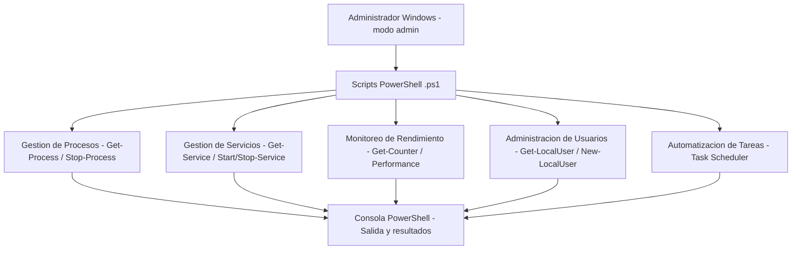

<div align="center">

# 📌 Sistemas Operativos - Manejo de un Sistema Operativo en PowerShell  

## 📖 Descripción

</div>

---

Proyecto que explora el uso avanzado de PowerShell para la administración de sistemas operativos Windows.

## 🛠️ Funcionalidades  
- Automatización de tareas del sistema.  
- Gestión de procesos y servicios en Windows.  
- Configuración y monitoreo del rendimiento.  
- Creación de scripts para la administración de usuarios.  

## 🚀 Tecnologías utilizadas  
- Windows PowerShell  
- Scripting en PowerShell  

## ▶️ Cómo ejecutar el proyecto  
1. Abrir PowerShell en modo administrador.  
2. Ejecutar los scripts con:  
   ```powershell
   .\script.ps1
   ```
3. Observar los resultados en la consola.  
4. Modificar los scripts para personalizar la configuración del sistema.  

## 📌 Autor  
👨‍💻 **Alejandro De Mendoza**

---

## Arquitectura



## Autor

**Alejandro De Mendoza**  
Ingeniero Informático · Especialista en IA · Especialista en Ingeniería de Software · Máster en Arquitectura de Software

[](https://github.com/AlejoTechEngineer)
